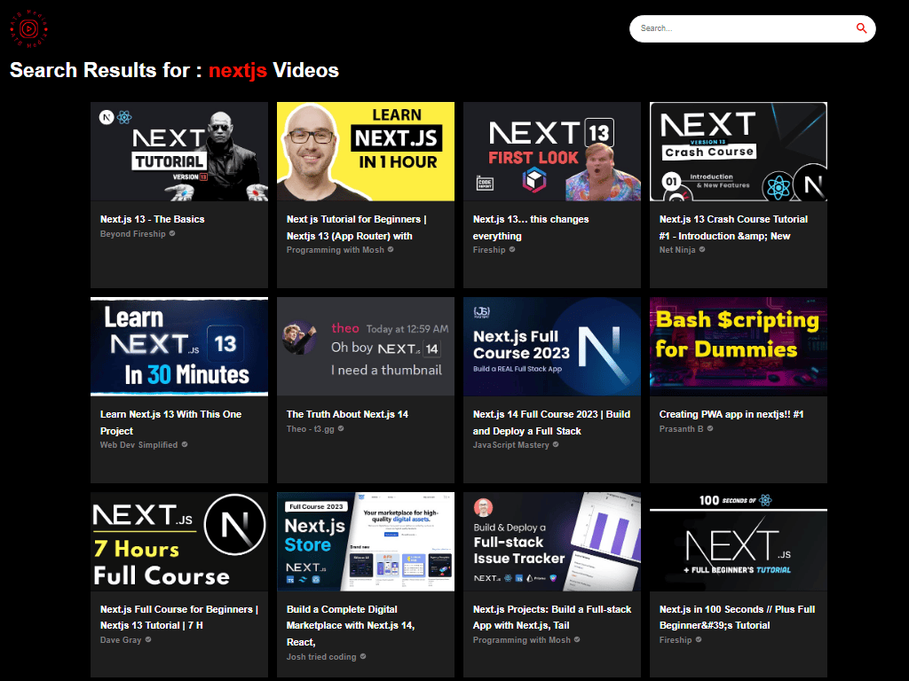
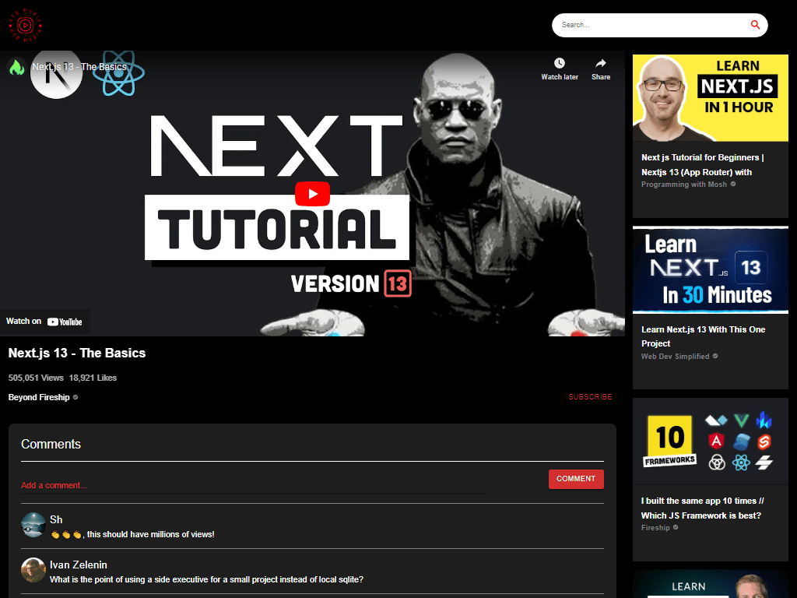
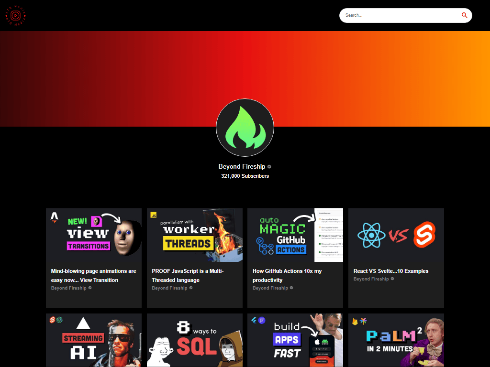

# 🍿 ATB Media

### A Youtube clone with a stunning videos section, categories, responsive channel and video cards, channel pages and most importantly video pages were you can play the video straight from the app, see related videos and much more... .(اگه ایران هستید از فیلترشکن استفاده کنید)

## Link 🔗 [https://charactermi.github.io/atb_media](https://charactermi.github.io/atb_media)

 

# Preview

 

# Mobile Responsive

# Technologies

 

<ul>
    <li>
        
    </li>
    <li>
        
    </li>
    <li>
        
    </li>
    <li>
        
    </li>
    <li>
        
    </li>
</ul>
